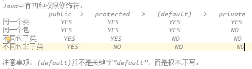
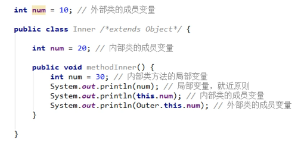

# final、权限、内部类

## *final*关键字

*final*关键字代表最终、不可改变的

### 常见四种用法

##### 	1.可以用来修饰一个类

​	格式

```java
public final class 类名称{
    //........
}
```

​	含义：当前这个类不能有任何的子类

​	注意：一个类如果是*final*的，那么其中所有的成员方法都无法进行覆盖重写

#### 2.可以用来修饰一个方法

​	当*final*关键字用来修饰一个方法的时候，这个方法就是最终方法，也就是不能被覆盖重写

​	格式

```java
修饰符 final 返回值类型 方法名(参数列表){
    //方法体
}
```

​	注意：对于类、方法来说，*abstract*和*final*关键字不能同时使用，*abstract*必须要继承覆盖重写使用，而*final*不可被继承覆盖重写。

#### 3.还可以用来修饰一个局部变量

​	一旦使用*final*关键字来叙事局部变量，那么这个变量就不能进行更改

​	对于基本类型来说，不可变的是变量当中的数据不可改变

​	对于引用类型来说，不可变的是变量当中的地址值不可改变，但内容可以改变

####	4.还可以用来修饰一个成员变量

​	对于成员变量，如果使用*final*关键字修饰，那么这个变量也是不可变的

​	注意：

​	1.由于成员变量有默认值，所以用了*final*之后必须手动赋值，不会再给默认值

​	2.队友*final*的成员变量，那么使用直接赋值，那么通过构造方法赋值，二者选其一

## 四种权限修饰符



## 内部类

​	概念：一个类内部包含了一个类

### 成员内部类

​	格式：

```java
修饰符 class 外部类名称 {
    修饰符 class 内部类名称 {
        //...
    }
    //.....
}
```

​	注意：内用外，随意访问；外用内，需要内部类对象

#### 使用成员内部类

​	1.间接方式：在外部类的方法当中，使用内部类，然后*main*方法只是调用外部类的方法

```java
类名称 对象名 = new 类名称();
```

​	2.直接使用：

```java
外部类名称.内部类名称 对象名 = new 外部类名称().new 内部类名称
```

​	如果出现了重名现象，使用格式是：

```java
外部类名称.this.外部类成员变量名
```



### 局部内部类

​	如果一个类是定义在一个方法内部的，那么这就是一个局部内部类，只有当前所属方法才能使用它，出了这个方法就不能用了

​	格式：

```java
修饰符 class 外部类名称{
    修饰符 返回值类型 外部类方法名称(参数列表){
        class 局部内部类名称{
            //.....
        }
    }
}
```

​	定义一个类的时候，权限修饰符规则：

​	1.外部类：`public/（default）`

​	2.成员内部类：`public/protected/（default）/private`

​	3.局部内部类:什么都不写

​	局部内部类的创建：

```java
public class NameDemo {
    
public void method(){    
    class Inner{//局部内部类        
        int num = 10;        
        public void methodInner(){            		        			System.out.println(num);//10        
       		}    
    	} 
    //创建Inner对象，供method使用
    Inner inner = new Inner();    
    inner.methodInner();
	}
}
```

​	局部内部类的使用：

```java
public static void main(String[] args) {    
    NameDemo nameDemo = new NameDemo();
    //直接调用method方法
    nameDemo.method();//10
}
```

### 匿名内部类

​	如果接口的实现类（或是父类的子类）只需要使用唯一的一次，那么这种情况就可以省略掉该类的定义，而改为匿名内部类

​	格式：

```java
接口名称 对象名 = new 接口名称(){
    //覆盖重写所有的的抽象方法
};
```

​	对格式“*new* 接口名称(){......}”进行解析

​	1.*new*代表创建对象的动作

​	2.接口名称就是匿名内部类需要实现的那个接口

​	3.{.......}是匿名内部类的内容

**注意事项：**

​	1.匿名内部类，在**创建对象**的时候，只能使用唯一一次，如果希望多次创建对象，而且类的内容一样的话，那么就必须使用单独定义的实现类了

​	2.匿名对象，**在调用方法的时候**，只能调用唯一一次，如果希望同一个对象调用多次方法，那么必须给对象起个名字

​	3.匿名内部类是省略了**实现类/子类名称**，但是匿名对象时省略了**对象名称**

##

