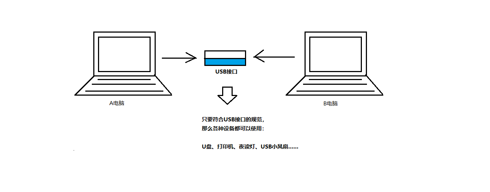
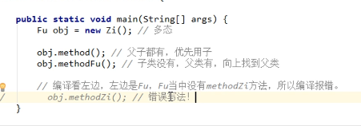

# 接口、多态

## 接口

​	接口就是一种**公共的规范标准**



### 接口的定义基本格式

```java
public interface 接口名称{
    .....//接口内容
}
```

​	备注：换成关键字*interface*之后，编译生成的字节码文件仍然是：*.java* ---> *.class*

​	如果是*java* 7，那么接口中可以包含的内容：1.常量；2.抽象方法

​	如果是*java* 8，那么可以额外包含：3.默认方法；4.静态方法	

​	如果是*java* 9，那么可以额外包含：5.私有方法

### 接口的使用

​	1.接口不能直接使用，必须有一个**实现类**来实现该接口

​	格式：

```java
public class 实现类名称 implements 接口名称{
    //......
}
```

​	2.接口的实现必须覆盖重写（实现）接口中所有的抽象方法

​	3.创建实现类的对象，进行使用

​	注意：如果实现类没有覆盖重写接口中所有的抽象方法，那么这个实现类自己就必须是抽象类

### 接口的默认方法定义

​	格式：

```java
public default 返回值类型 方法名称(参数列表){
    //.....
}
```

​	备注:接口当中的默认方法，可以解决接口升级的问题

​	接口默认方法的使用：

​	1.接口的默认方法，可以通过接口实现类对象，直接调用

​	2.接口的默认方法，也可以被接口实现类进行覆盖重写

### 接口的静态方法定义

​	格式：

```java
public static 返回值类型 方法名称(参数列表){
    //......
}
```

​	**注意**：不能通过实现类的对象来调用接口当中的静态方法

​	正确用法：通过接口名称，直接调用当中的静态方法

```java
接口名称.静态方法名(参数);
```

### 接口的私有方法定义

​	1.普通私有方法：解决多个默认方法之间的重复代码问题

```java
private 返回值类型 方法名称(参数列表){
    //方法体
}
```

​	2.静态私有方法：解决多个静态方法之间的重复代码问题

```java
private static 返回值类型 方法名称(参数列表){
	//方法体
}
```

### 接口的常量定义和使用

​	接口当中可以定义"成员变量"，但是必须使用*public static final*三个关键字进行修饰，从效果上看，这其实就是接口的常量

```java
public static final 数据类型 常量名称 = 数据值;
```

​	备注：一旦使用*final*关键字进行修饰，说明不可改变

​	注意事项：

​	1.接口当中的常量，可以省略*public static final*

​	2.接口当中的常量，必须进行赋值

​	3.接口中常量的名称，使用完全大写的字母，用下划线进行分割（推荐写法）

### 注意事项：

​	1.接口没有静态代码块或者构造方法

​	2.一个类的直接父类是唯一的，但是一个类可以实现多个接口

```java
public class InterfaceImpl implements InterfaceA,InterfaceB{
    //覆盖重写所有抽象方法
} 
```

​	3.如果实现类所实现的多个接口中，存在重复的抽象方法，那么只需覆盖重写一次即可

​	4.如果实现类没有覆盖重写所有接口当中的所有抽象方法，那么实现类就必须是一个抽象类

​	5.如果实现类所实现的多个接口当中，存在重复的默认方法，那么实现类一定要对冲突的默认方法进行覆盖重写

​	6.一个类如果直接父类当中的方法和接口当中默认方法产生了冲突，优先使用父类当中的方法

​	7.接口与接口之间是多继承的

```java
public interface IntefaceA extends IntefaceB,Interface{
    //.....
}
```

​	如果多个父接口中的默认方法重复，则子接口必须进行默认方法的覆盖重写，**并且*default*不能删掉**

## 多态

​	*extends*和*implements*是多态的前提

​	代码当中体现多态性：父类引用指向子类对象

```java
父类名称 对象名称 = new 子类名称();
```

```java
接口名称 对象名称 = new 实现类名称();
```

​	在多态的代码中，成员方法的访问规则是：看new的是谁，就优先用谁，没有则向上找

​	成员变量：编译看左边，运行还看左边

​	成员方法：编译看左边，运行看右边



### 对象的向上转型

​	格式

```java
父类名称 对象名 = new 子类名称();
```

​	含义：右侧创建一个子类对象，把他当做父类来看待

​	注意事项：向上转型**一定是安全的**，从小范围转向了大范围


### 对象的向下转型

​	对象的向下转型，其实是一个还原动作

​	格式

```java
子类名称 对象名 = (子类名称)父类对象
```

​	含义：将父类对象还原成本来的子类对象