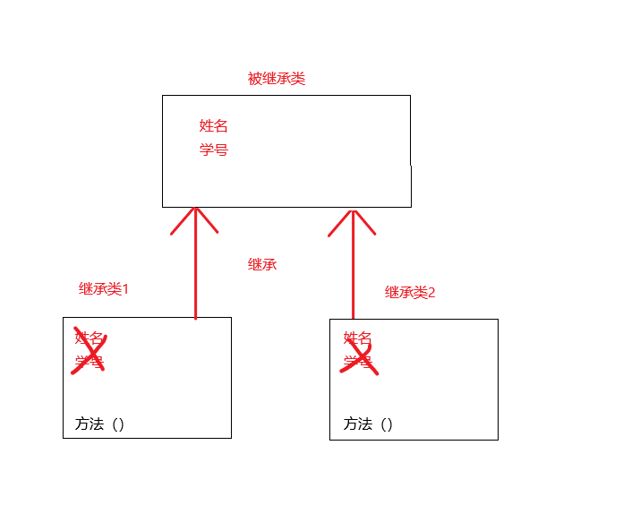

# 继承、super、this、抽象类

## 继承

### 继承的概述

​	继承是多态的前提，如果没有继承，就没有多态

​	继承主要解决的问题是：**共性抽取**

​	

### 继承的格式

​	在继承的关系中，**“子类就是一个父类”**，也就是说，子类可以被当做父类看待

​	定义父类的格式(一个普通的定义类)：

```java
public class 父类名称{
    //........
}
```

​	定义子类的格式：

```java
public class 子类名称 extends 父类名称{
	//........
}
```

### 继承中成员变量方法的访问特点

​	1.在父子类继承关系中，如果成员变量重名，则创建子类对象时，访问有两种方式：

​		a.直接通过子类对象访问成员变量：创建对象时等号左边是谁，就优先用谁，没有则向上找**(父类)**

​		b.间接通过成员方法访问成员变量：方法属于谁，就优先用谁，没有则向上找

​	2.创建子类对象，访问成员方法的规则：创建的对象是谁，就优先用谁，如果没有则向上找		

### 区分子类方法中重名的三种变量

​	局部变量：直接写成员变量

​	本类的成员变量：`this.成员变量`

​	父类的成员变量：`super.成员变量`

​	

### 继承中方法的覆盖重写

​	重写（*Override*）:在继承关系中，方法的名称一样，参数列表**也一样**

​	重载（Overload）：方法的名称一样，参数列表**不一样**

​	方法的覆盖重写特点：创建的是子类对象，则优先使用子类方法

**注意事项**：

​	1.必须保证父子类之间的**方法名称相同**，**参数列表也相同**。		      		***@Override*：写在方法前面**，用来检测是不是有效的正确覆盖重写，但是就算不写这个注释，只要满足要求，也是正确的方法覆盖重写

​	2.子类方法的返回值必须**小于等于**父类方法的返回值类型                                     		提示：`java.lang.Object`类是所有类的公共最高父类，`java.lang.String`就是Object的子类

​	3.子类方法的权限必须**大于等于**父类方法的权限修饰符				     		

提示：`public>protected>(default)>private`							   			

注意：`（default）`不是关键字*default*，而是什么都不写，留空

### 继承中构造方法的访问特点

​	1.子类构造方法当中有一个默认隐含的`super()`调用，所以一定是先调用的父类构造器，后执行的子类构造器

​	2.子类构造可以通过*super*关键字来调用父类重载构造

​	3.*super*的父类构造调用，**必须是子类构造方法的第一个语句**，**不能一个子类构造调用多次*super*构造**

​	总结：子类必须调用父类构造方法，不写则默认写*super*

​	**注意**：只有子类构造方法，才能调用父类构造方法

### *super*关键字的三种用法

​	*super*用来**访问父类内容**

​	1.在子类的成员方法中，访问父类的成员变量

​	2.在子类的成员方法中，访问父类的成员方法

​	3.在子类的构造方法中，访问父类的构造方法

### *this*关键字的三种用法

​	*this*关键字用来**访问本类内容**：

​	1.在本类的成员方法中，访问本类的成员变量

​	2.在本类的成员方法中，访问本类的另一个成员方法

​	3.在本类的构造方法中，访问本类的另一个构造方法					 	  

 使用第三种用法时要注意:

a.*this*(.....)调用也**必须是构造方法的第一个语句，唯一一个**。

b.***super*和*this*两种构造调用，不能同时使用**


### *java*继承的的三个特点

1. *java*语言是**单继承**的

​	一个类的直接父类只能有唯一一个

```java
class A{}
class B extends A{}    //正确
class C{}
class D extends A,C{}  //错误
```

2. *java*语言可以**多级继承**

``` java
class A{}
class B extends A{}    //正确
class C extends B{}    //正确
```

3. 一个子类的直接父类是唯一的，但是一个父类可以拥有很多个子类

```java
class A{}
class B extends A{}   //正确
class C extends A{}   //正确
```

## 抽象类

### 抽象方法和抽象类的格式

​	抽象方法：就是加上***abstract*关键字**，然后去掉大括号，直接分号结束

​	抽象类：抽象方法所在的类，必须是抽象类才行。在*class*之前写上*abstract*即可

```java
//创建一个抽象类
piblic abstract class Animal{
    
    //这是一个抽象方法，代表吃东西，但是具体吃什么()不确定
    public abstract void eat();
    
    //普通的成员方法
    public void method(){}
    
}
```

### 抽象方法和抽象类的使用

​	1.不能直接创建*new*抽象类对象

​	2.必须用一个子类继承抽象父类

```java
public abstract class Animal {   
    public abstract void eat();
}
```

​	3.子类必须覆盖重写抽象父类当中所有的抽象方法

​		覆盖重写（实现）:子类**去掉**抽象类方法中的*abstract*关键字，然后补上方法体{}

```java
public class Cat extends Animal{    
    public void eat(){       
        System.out.println("猫吃鱼");    
    }
}
```

​	4.创建子类对象进行使用

```java
public static void main(String[] args) {   
    Cat cat = new Cat();   
    cat.eat();
}
```

### 抽象方法和抽象类的注意事项

- 抽象类**不能创建对象**，如果创建，编译无法通过而报错，只能创建其非抽象子类的对象

  理解：假设创建了抽象类的对象，调用抽象的方法，而抽象方法没有具体的方法体，没有意义

- 抽象类中，可以有构造方法，是供子类创建对象时，初始化父类成员使用的

  理解：子类的构造方法中，有默认的*super()*，需要访问父类构造方法

- 抽象类中，不一定包含抽象方法，但是有抽象方法的必定是抽象类

  理解：未包含抽象方法的抽象类，目的就是不想让调用者创建该类对象，通常用于某些特殊的类结构设计

- 抽象类的子类，必须**重写抽象父类中所有的抽象方法**，否则无法编译，除非该子类也是抽象类

  理解：假设不重写所有的抽象方法，则类中可能包含抽象方法，那么创建对象后，调用抽象的方法，没有意义

  

