# Map

#  Map集合

## 1.1 概述

现实生活中，我们常会看到这样的一种集合：IP地址与主机名，身份证号与个人，系统用户名与系统用户对象等，这种一一对应的关系，就叫做映射。Java提供了专门的集合类用来存放这种对象关系的对象，即`java.util.Map`接口

我们通过查看`Map`接口描述，发现`Map`接口下的集合与`Collection`接口下的集合，它们存储数据的形式不同，如下图

* `Collection`中的集合，元素是孤立存在的（理解为单身），向集合中存储元素采用一个个元素的方式存储
* `Map`中的集合，元素是成对存在的(理解为夫妻)。每个元素由键与值两部分组成，通过键可以找对所对应的值
* `Collection`中的集合称为单列集合，`Map`中的集合称为双列集合
* 需要注意的是，`Map`中的集合不能包含重复的键，值可以重复；每个键只能对应一个值

## 1.2  Map常用子类

通过查看Map接口描述，看到Map有多个子类，这里我们主要讲解常用的HashMap集合、LinkedHashMap集合

* **HashMap<K,V>**：存储数据采用的哈希表结构，元素的存取顺序不能保证一致。由于要保证键的唯一、不重复，需要重写键的hashCode()方法、equals()方法
* **LinkedHashMap<K,V>**：HashMap下有个子类LinkedHashMap，存储数据采用的哈希表结构+链表结构。通过链表结构可以保证元素的存取顺序一致；通过哈希表结构可以保证的键的唯一、不重复，需要重写键的hashCode()方法、equals()方法

> tips：Map接口中的集合都有两个泛型变量<K,V>,在使用时，要为两个泛型变量赋予数据类型。两个泛型变量<K,V>的数据类型可以相同，也可以不同
>

## 1.3  Map接口中的常用方法

Map接口中定义了很多方法，常用的如下：

* `public V put(K key, V value)`:  把指定的键与指定的值添加到Map集合中
* `public V remove(Object key)`: 把指定的键 所对应的键值对元素 在Map集合中删除，返回被删除元素的值
* `public V get(Object key)` 根据指定的键，在Map集合中获取对应的值
* `boolean containsKey(Object key)  ` 判断集合中是否包含指定的键
* `public Set<K> keySet()`: 获取Map集合中所有的键，存储到Set集合中
* `public Set<Map.Entry<K,V>> entrySet()`: 获取到Map集合中所有的键值对对象的集合(Set集合)

Map接口的方法演示

~~~java
public class MapDemo {
    public static void main(String[] args) {
        //创建 map对象
        HashMap<String, String>  map = new HashMap<String, String>();

        //添加元素到集合
        map.put("黄晓明", "杨颖");
        map.put("文章", "马伊琍");
        map.put("邓超", "孙俪");
        System.out.println(map);

        //String remove(String key)
        System.out.println(map.remove("邓超"));
        System.out.println(map);

        // 想要查看 黄晓明的媳妇 是谁
        System.out.println(map.get("黄晓明"));
        System.out.println(map.get("邓超"));    
    }
}
~~~

> tips:
>
> 使用put方法时，若指定的键(key)在集合中没有，则没有这个键对应的值，返回null，并把指定的键值添加到集合中
>
> 若指定的键(key)在集合中存在，则返回值为集合中键对应的值（该值为替换前的值），并把指定键所对应的值，替换成指定的新值。

## 1.4   Map集合遍历键找值方式

键找值方式：即通过元素中的键，获取键所对应的值

分析步骤：

1. 获取Map中所有的键，由于键是唯一的，所以返回一个Set集合存储所有的键。方法提示:`keyset()`
2. 遍历键的Set集合，得到每一个键
3. 根据键，获取键所对应的值，方法提示:`get(K key)`

代码演示：

~~~java
public class MapDemo01 {
    public static void main(String[] args) {
        //创建Map集合对象 
        HashMap<String, String> map = new HashMap<String,String>();
        //添加元素到集合 
        map.put("胡歌", "霍建华");
        map.put("郭德纲", "于谦");
        map.put("薛之谦", "大张伟");

        //获取所有的键  获取键集
        Set<String> keys = map.keySet();
        // 遍历键集 得到 每一个键
        for (String key : keys) {
          	//key  就是键
            //获取对应值
            String value = map.get(key);
            System.out.println(key+"的CP是："+value);
        }  
    }
}
~~~

遍历图解：

## 1.5  Entry键值对对象

`Map`中存放的是两种对象，一种称为**key**(键)，一种称为**value**(值)，它们在在`Map`中是一一对应关系，这一对对象又称做`Map`中的一个`Entry(项)`。`Entry`将键值对的对应关系封装成了对象。即键值对对象，这样我们在遍历`Map`集合时，就可以从每一个键值对（`Entry`）对象中获取对应的键与对应的值

 既然Entry表示了一对键和值，那么也同样提供了获取对应键和对应值得方法：

* `public K getKey()`：获取Entry对象中的键
* `public V getValue()`：获取Entry对象中的值

在Map集合中也提供了获取所有Entry对象的方法：

* `public Set<Map.Entry<K,V>> entrySet()`: 获取到Map集合中所有的键值对对象的集合(Set集合)

## 1.6 Map集合遍历键值对方式

键值对方式：即通过集合中每个键值对(Entry)对象，获取键值对(Entry)对象中的键与值

操作步骤与图解：

1.  获取Map集合中，所有的键值对(Entry)对象，以Set集合形式返回。方法提示:`entrySet()`

2.  遍历包含键值对(Entry)对象的Set集合，得到每一个键值对(Entry)对象
3.  通过键值对(Entry)对象，获取Entry对象中的键与值。  方法提示:`getkey() getValue()`     

~~~java
public class MapDemo02 {
    public static void main(String[] args) {
        // 创建Map集合对象 
        HashMap<String, String> map = new HashMap<String,String>();
        // 添加元素到集合 
        map.put("胡歌", "霍建华");
        map.put("郭德纲", "于谦");
        map.put("薛之谦", "大张伟");

        // 获取 所有的 entry对象  entrySet
        Set<Entry<String,String>> entrySet = map.entrySet();

        // 遍历得到每一个entry对象
        for (Entry<String, String> entry : entrySet) {
           	// 解析 
            String key = entry.getKey();
            String value = entry.getValue();  
            System.out.println(key+"的CP是:"+value);
        }
    }
}
~~~

遍历图解：

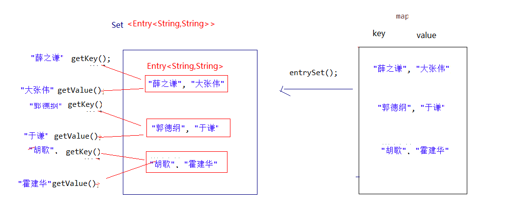

> tips：Map集合不能直接使用迭代器或者foreach进行遍历。但是转成Set之后就可以使用了
>

## 1.7  HashMap存储自定义类型键值

练习：每位学生（姓名，年龄）都有自己的家庭住址。那么，既然有对应关系，则将学生对象和家庭住址存储到map集合中。学生作为键, 家庭住址作为值

> 注意，学生姓名相同并且年龄相同视为同一名学生
>

编写学生类：

~~~java
public class Student {
    private String name;
    private int age;

    public Student() {
    }

    public Student(String name, int age) {
        this.name = name;
        this.age = age;
    }

    public String getName() {
        return name;
    }

    public void setName(String name) {
        this.name = name;
    }

    public int getAge() {
        return age;
    }

    public void setAge(int age) {
        this.age = age;
    }

    @Override
    public boolean equals(Object o) {
        if (this == o)
            return true;
        if (o == null || getClass() != o.getClass())
            return false;
        Student student = (Student) o;
        return age == student.age && Objects.equals(name, student.name);
    }

    @Override
    public int hashCode() {
        return Objects.hash(name, age);
    }
}
~~~

编写测试类：

~~~java 
public class HashMapTest {
    public static void main(String[] args) {
        //1,创建Hashmap集合对象。
        Map<Student,String>map = new HashMap<Student,String>();
        //2,添加元素。
        map.put(newStudent("lisi",28), "上海");
        map.put(newStudent("wangwu",22), "北京");
        map.put(newStudent("zhaoliu",24), "成都");
        map.put(newStudent("zhouqi",25), "广州");
        map.put(newStudent("wangwu",22), "南京");
        
        //3,取出元素。键找值方式
        Set<Student>keySet = map.keySet();
        for(Student key: keySet){
            Stringvalue = map.get(key);
            System.out.println(key.toString()+"....."+value);
        }
    }
}
~~~

* 当给HashMap中存放自定义对象时，如果自定义对象作为key存在，这时要保证对象唯一，必须复写对象的hashCode和equals方法(如果忘记，请回顾HashSet存放自定义对象)
* 如果要保证map中存放的key和取出的顺序一致，可以使用`java.util.LinkedHashMap`集合来存放

## 1.8   LinkedHashMap

HashMap保证成对元素唯一，并且查询速度很快，可是成对元素存放进去是没有顺序的，那么我们要保证有序，还要速度快怎么办呢？

在HashMap下面有一个子类LinkedHashMap，它是链表和哈希表组合的一个数据存储结构

~~~java
public class LinkedHashMapDemo {
    public static void main(String[] args) {
        LinkedHashMap<String, String> map = new LinkedHashMap<String, String>();
        map.put("邓超", "孙俪");
        map.put("李晨", "范冰冰");
        map.put("刘德华", "朱丽倩");
        Set<Entry<String, String>> entrySet = map.entrySet();
        for (Entry<String, String> entry : entrySet) {
            System.out.println(entry.getKey() + "  " + entry.getValue());
        }
    }
}
~~~

结果:

~~~
邓超  孙俪
李晨  范冰冰
刘德华  朱丽倩
~~~

## 1.9 Map集合练习

**需求：**

计算一个字符串中每个字符出现次数

**分析：**

1.  获取一个字符串对象
2.  创建一个Map集合，键代表字符，值代表次数
3.  遍历字符串得到每个字符
4.  判断Map中是否有该键
5.  如果没有，第一次出现，存储次数为1；如果有，则说明已经出现过，获取到对应的值进行++，再次存储  
6.  打印最终结果

**代码：**

~~~java
public class MapTest {
public static void main(String[] args) {
        //友情提示
        System.out.println("请录入一个字符串:");
        String line = new Scanner(System.in).nextLine();
        // 定义 每个字符出现次数的方法
        findChar(line);
    }
    private static void findChar(String line) {
        //1:创建一个集合 存储  字符 以及其出现的次数
        HashMap<Character, Integer> map = new HashMap<Character, Integer>();
        //2:遍历字符串
        for (int i = 0; i < line.length(); i++) {
            char c = line.charAt(i);
            //判断 该字符 是否在键集中
            if (!map.containsKey(c)) {//说明这个字符没有出现过
                //那就是第一次
                map.put(c, 1);
            } else {
                //先获取之前的次数
                Integer count = map.get(c);
                //count++;
                //再次存入  更新
                map.put(c, ++count);
            }
        }
        System.out.println(map);
    }
}
~~~

#  补充知识点

## 2.1  JDK9对集合添加的优化

通常，我们在代码中创建一个集合（例如，List 或 Set ），并直接用一些元素填充它。 实例化集合，几个 add方法 调用，使得代码重复

~~~java
public class Demo01 {
    public static void main(String[] args) {
        List<String> list = new ArrayList<>();
        list.add("abc");
        list.add("def");
        list.add("ghi");
        System.out.println(list);
    }
}
~~~

 Java 9，添加了几种集合工厂方法,更方便创建少量元素的集合、map实例。新的List、Set、Map的静态工厂方法可以更方便地创建集合的不可变实例

例子：

~~~java
public class HelloJDK9 {  
    public static void main(String[] args) {  
        Set<String> str1=Set.of("a","b","c");  
        //str1.add("c");这里编译的时候不会错，但是执行的时候会报错，因为是不可变的集合  
        System.out.println(str1);  
        Map<String,Integer> str2=Map.of("a",1,"b",2);  
        System.out.println(str2);  
        List<String> str3=List.of("a","b");  
        System.out.println(str3);  
    }  
} 
~~~

需要注意以下两点：

> 1:of()方法只是Map，List，Set这三个接口的静态方法，其父类接口和子类实现并没有这类方法，比如    HashSet，ArrayList等待；
>
> 2:返回的集合是不可变的；

## 2.2 Debug追踪

**使用IDEA的断点调试功能，查看程序的运行过程**

1. 在有效代码行，点击行号右边的空白区域，设置断点，程序执行到断点将停止，我们可以手动来运行程序 	

      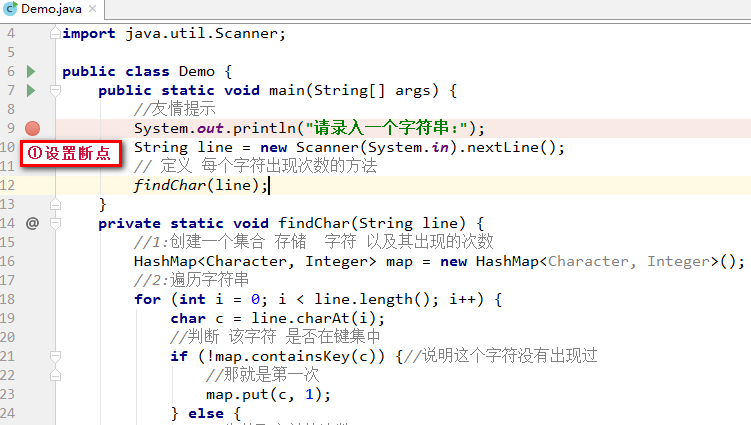

2. 点击Debug运行模式       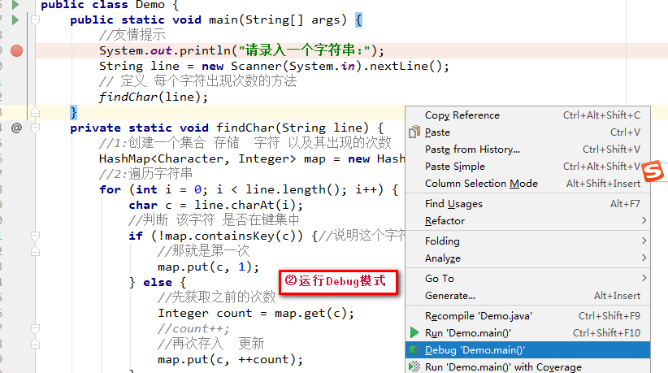                                                                                                                                                                      

3.  程序停止在断点上不再执行，而IDEA最下方打开了Debug调试窗口  

     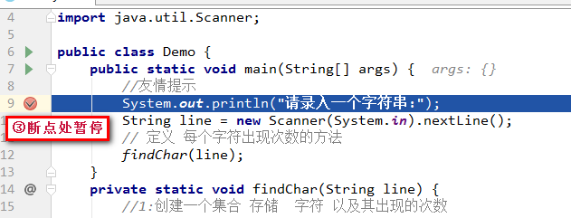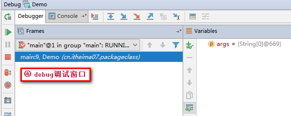

4. Debug调试窗口介绍

    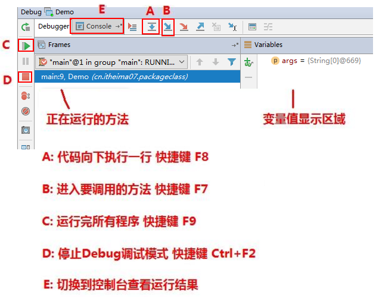

5. 快捷键F8，代码向下执行一行,第九行执行完毕，执行到第10行（第10行还未执行）

   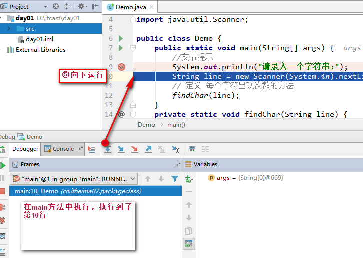

6. 切换到控制台面板，控制台显示 请录入一个字符串： 并且等待键盘录入

   

7. 快捷键F8，程序继续向后执行，执行键盘录入操作，在控制台录入数据 ababcea

   

   回车之后效果：

   调试界面效果：

8. 此时到达findChar方法，快捷键F7，进入方法findChar

   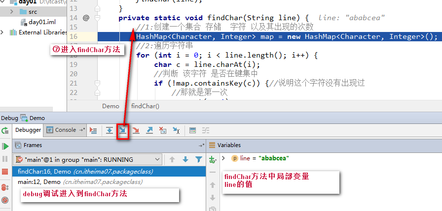

9. 快捷键F8 接续执行，创建了map对象，变量区域显示

   

10. 快捷键F8 接续执行，进入到循环中，循环变量i为 0,F8再继续执行，就获取到变量c赋值为字符‘a’ 字节值97

    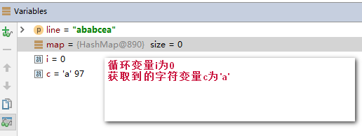

11. 快捷键F8 接续执行，进入到判断语句中，因为该字符 不在Map集合键集中，再按F8执行，进入该判断中

    

12. 快捷键F8 接续执行，循环结束，进入下次循环，此时map中已经添加一对儿元素

    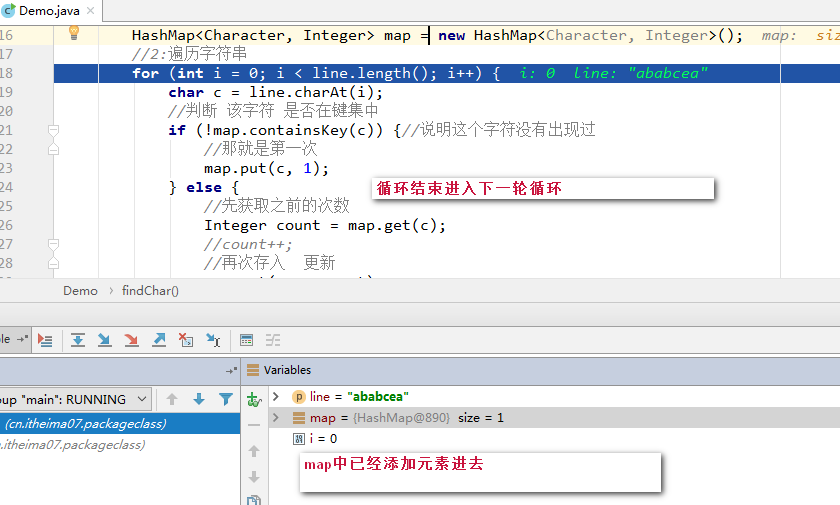

13. 快捷键F8 接续执行，进入下次循环，再继续上面的操作，我们就可以看到代码每次是如何执行的了

    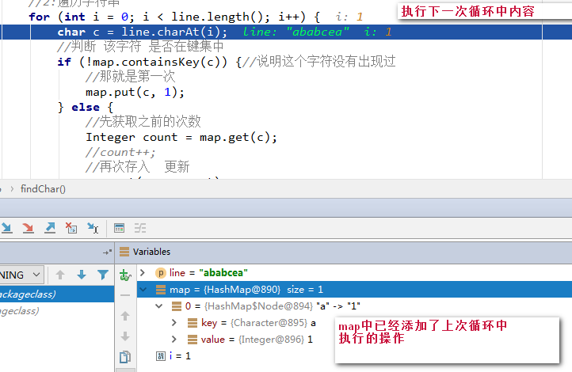

14. 如果不想继续debug,那么可以使用快捷键F9,程序正常执行到结束，程序结果在控制台显示

    

#  模拟斗地主洗牌发牌

## 3.1 案例介绍

按照斗地主的规则，完成洗牌发牌的动作。

具体规则：

1. 组装54张扑克牌将
2. 54张牌顺序打乱
3. 三个玩家参与游戏，三人交替摸牌，每人17张牌，最后三张留作底牌。
4. 查看三人各自手中的牌（按照牌的大小排序）、底牌

> 规则：手中扑克牌从大到小的摆放顺序：大王,小王,2,A,K,Q,J,10,9,8,7,6,5,4,3
>

## 3.2 案例需求分析

1.  准备牌：

完成数字与纸牌的映射关系：

使用双列Map(HashMap)集合，完成一个数字与字符串纸牌的对应关系(相当于一个字典)

2.  洗牌：

通过数字完成洗牌发牌

3.  发牌：

将每个人以及底牌设计为ArrayList<String>,将最后3张牌直接存放于底牌，剩余牌通过对3取模依次发牌

存放的过程中要求数字大小与斗地主规则的大小对应

将代表不同纸牌的数字分配给不同的玩家与底牌

4.  看牌：

通过Map集合找到对应字符展示

通过查询纸牌与数字的对应关系，由数字转成纸牌字符串再进行展示

## 3.3  实现代码步骤

~~~java
public class Poker {
    public static void main(String[] args) {
        /*
         * 1组装54张扑克牌
         */
        // 1.1 创建Map集合存储
        HashMap<Integer, String> pokerMap = new HashMap<Integer, String>();
        // 1.2 创建 花色集合 与 数字集合
        ArrayList<String> colors = new ArrayList<String>();
        ArrayList<String> numbers = new ArrayList<String>();

        // 1.3 存储 花色 与数字
        Collections.addAll(colors, "♦", "♣", "♥", "♠");
        Collections.addAll(numbers, "2", "A", "K", "Q", "J", "10", "9", "8", "7", "6", "5", "4", "3");
        // 设置 存储编号变量
        int count = 1;
        pokerMap.put(count++, "大王");
        pokerMap.put(count++, "小王");
        // 1.4 创建牌 存储到map集合中
        for (String number : numbers) {
            for (String color : colors) {
                String card = color + number;
                pokerMap.put(count++, card);
            }
        }
        /*
         * 2 将54张牌顺序打乱
         */
        // 取出编号 集合
        Set<Integer> numberSet = pokerMap.keySet();
        // 因为要将编号打乱顺序 所以 应该先进行转换到 list集合中
        ArrayList<Integer> numberList = new ArrayList<Integer>();
        numberList.addAll(numberSet);

        // 打乱顺序
        Collections.shuffle(numberList);

        // 3 完成三个玩家交替摸牌，每人17张牌，最后三张留作底牌
        // 3.1 发牌的编号
        // 创建三个玩家编号集合 和一个 底牌编号集合
        ArrayList<Integer> noP1 = new ArrayList<Integer>();
        ArrayList<Integer> noP2 = new ArrayList<Integer>();
        ArrayList<Integer> noP3 = new ArrayList<Integer>();
        ArrayList<Integer> dipaiNo = new ArrayList<Integer>();

        // 3.2发牌的编号
        for (int i = 0; i < numberList.size(); i++) {
            // 获取该编号
            Integer no = numberList.get(i);
            // 发牌
            // 留出底牌
            if (i >= 51) {
                dipaiNo.add(no);
            } else {
                if (i % 3 == 0) {
                    noP1.add(no);
                } else if (i % 3 == 1) {
                    noP2.add(no);
                } else {
                    noP3.add(no);
                }
            }
        }

        // 4 查看三人各自手中的牌（按照牌的大小排序）、底牌
        // 4.1 对手中编号进行排序
        Collections.sort(noP1);
        Collections.sort(noP2);
        Collections.sort(noP3);
        Collections.sort(dipaiNo);

        // 4.2 进行牌面的转换
        // 创建三个玩家牌面集合 以及底牌牌面集合
        ArrayList<String> player1 = new ArrayList<String>();
        ArrayList<String> player2 = new ArrayList<String>();
        ArrayList<String> player3 = new ArrayList<String>();
        ArrayList<String> dipai = new ArrayList<String>();

        // 4.3转换
        for (Integer i : noP1) {
            // 4.4 根据编号找到 牌面 pokerMap
            String card = pokerMap.get(i);
            // 添加到对应的 牌面集合中
            player1.add(card);
        }

        for (Integer i : noP2) {
            String card = pokerMap.get(i);
            player2.add(card);
        }
        for (Integer i : noP3) {
            String card = pokerMap.get(i);
            player3.add(card);
        }
        for (Integer i : dipaiNo) {
            String card = pokerMap.get(i);
            dipai.add(card);
        }

        //4.5 查看
        System.out.println("令狐冲："+player1);
        System.out.println("石破天："+player2);
        System.out.println("鸠摩智："+player3);
        System.out.println("底牌："+dipai);
    }
}
~~~

 

 

 